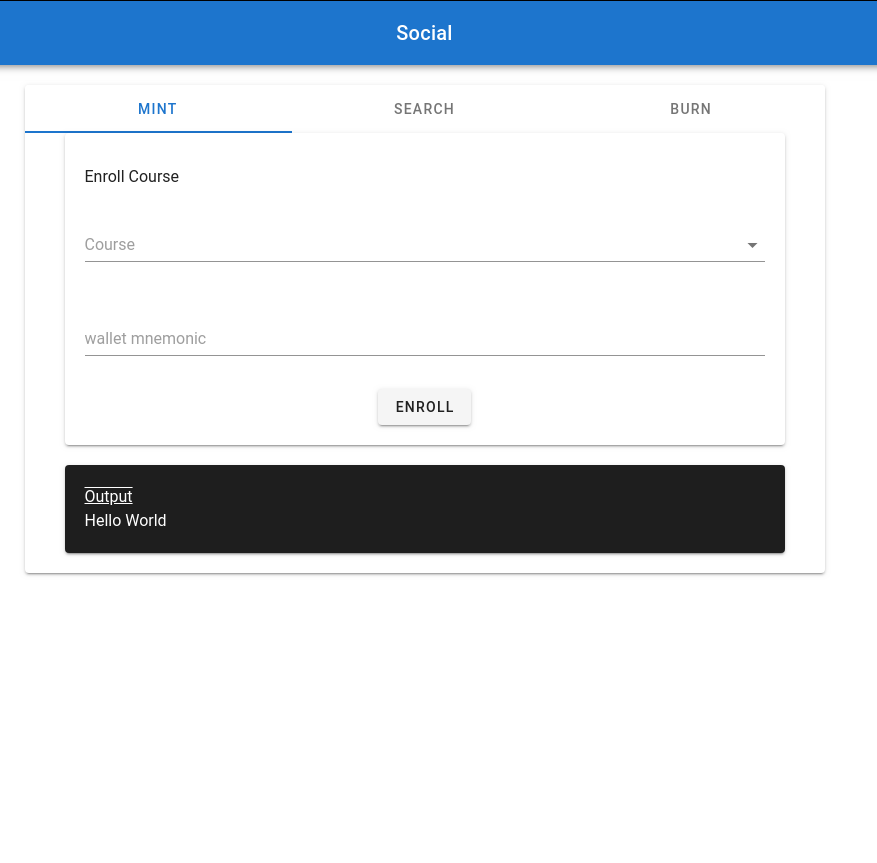

# 

## Social

## Problem Statement

- To ensure everyone’s safety during a pandemic, we need to maintain physical distance, but as our regular lives become disrupted, how can we use blockchain technology to navigate this change? This is a challenge where we will allow creative freedom and evaluate the quality of the solution based on how well it solves the problem presented by each group.

## Potential Solution

- An online medical consultation platform for home-based or self-quarantined patients.  
- A trusted platform to find your merchants or any providers genuineness.
- An online medical consultation platform for home-based or self quarantive patient with guarantee privacy.

## Start Up Social Project

### Step 1 - Start up blockchain localnet

- Start localnet [here](https://github.com/maxonrow/maxathon/tree/master/blockchain-starter-kit)

### Step 2 - Clone project

- Clone project `$ git clone https://github.com/maxonrow/challenge-social.git`

### Step 3 - Navigate to path

- Go to path `cd challenge-social/social`

### Step 4 - Build & run service

- run `npm i` & subsequently with `sudo npm run serve` & your service should be up at `http://localhost:3002/`

### Step 5 - Expected output

